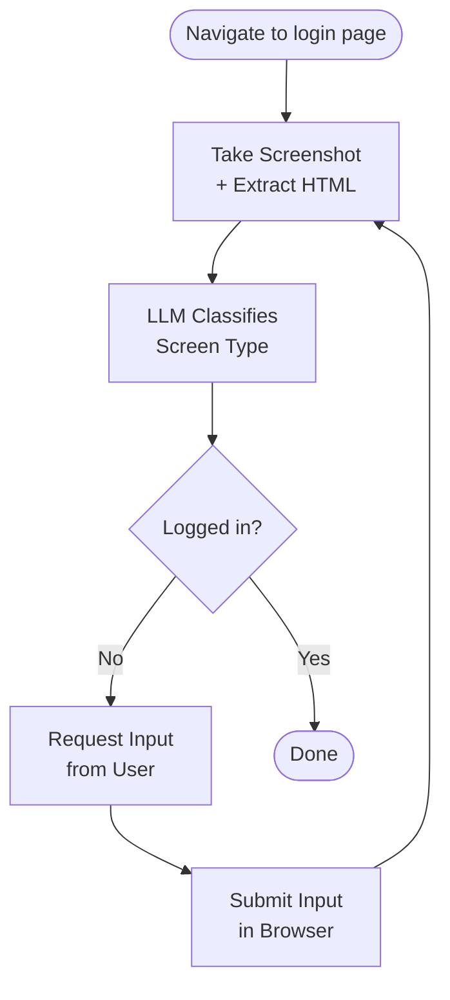

<p align="center">
  <a href="https://anon.com">
    <picture>
      <source media="(prefers-color-scheme: dark)" srcset="https://cdn.prod.website-files.com/689bc3805f94765d37f8acd7/689e250badcbdc3397449e2e_Anon%20Official%20Logo%20-%20White.svg">
      <source media="(prefers-color-scheme: light)" srcset="https://cdn.prod.website-files.com/689bc3805f94765d37f8acd7/689c252a7e6af0f5b331a1b1_Anon%20Brandmark%20-%20Black.svg">
      
    </picture>
  </a>
</p>

<h1 align="center">Login Machine</h1>

<p align="center">
  <strong>One browser agent loop that logs into any website.</strong><br>
  Credentials never touch the model. They flow directly into the browser DOM.
</p>

<p align="center">
  <a href="https://github.com/RichardHruby/login-machine/blob/main/LICENSE"></a>
  <a href="https://github.com/RichardHruby/login-machine/stargazers"></a>
  <a href="https://x.com/HrubyOnRails/status/2022039848048361807"></a>
  <a href="https://login-machine.vercel.app/"></a>
</p>

<p align="center">
  <a href="https://login-machine.vercel.app/">Try the live demo</a> •
  <a href="https://x.com/HrubyOnRails/status/2022039848048361807">Article</a> •
  <a href="#quick-start">Quick Start</a> •
  <a href="#how-it-works">How It Works</a> •
  <a href="#screen-types">Screen Types</a> •
  <a href="#design-principles">Design Principles</a> •
  <a href="#architecture">Architecture</a>
</p>

---

## Why

If you're building browser agents that need to log into websites, you know the pain. Every website has a different login flow, and traditional automation means writing a dedicated script for each one. Hardcoded selectors, brittle state machines, everything breaks when a site ships a redesign.

But login pages are designed for humans. Every screen is self-contained. You can always figure out what to do just by looking at it. An LLM with vision can do the same.

At <a href="https://anon.com">Anon</a> the Login Machine replaced hundreds of per-website scripts with a single agent loop that works for any login flow: multi-step credentials, SSO pickers, MFA prompts, magic links, all handled by the same code.

## Quick Start

```bash
cp .env.example .env.local
# Fill in your API keys
npm install
npm run dev
```

Open [http://localhost:3000](http://localhost:3000) and paste a login URL, or try the [hosted demo](https://login-machine.vercel.app/).

### Environment Variables

| Variable | Description |
|---|---|
| `ANTHROPIC_API_KEY` | [Anthropic](https://console.anthropic.com/) API key for Claude |
| `BROWSERBASE_API_KEY` | [BrowserBase](https://www.browserbase.com/) API key |
| `BROWSERBASE_PROJECT_ID` | [BrowserBase](https://www.browserbase.com/) project ID |

## How It Works



**Stripped HTML + screenshot.** Raw page HTML is full of scripts, styles, SVGs, and tracking pixels. The extractor walks the DOM recursively, strips everything except form-relevant tags and attributes, and traverses Shadow DOM boundaries so enterprise SSO widgets aren't missed. This cuts token usage by roughly 10x on complex pages and reduces hallucinated locators.

**Credential isolation.** The LLM analyzes the page and returns structured data describing what fields exist and their Playwright locators. It never sees what the user types. Credentials flow directly from the user into the browser DOM via Playwright.

**Self-correcting locators.** Every LLM-generated Playwright locator is validated against the live DOM before use. If a locator doesn't match, the error is fed back to the LLM in `<error-history>` tags for retry with context (up to 3 attempts).

## Screen Types

The LLM classifies every page into one of six types, each with a strict Zod schema:

| Type | What It Is | How It's Handled |
|---|---|---|
| `credential_login_form` | Email, password, OTP fields + submit button | Shows dynamic form → user fills → agent types into DOM |
| `choice_screen` | Account picker, SSO options, workspace selector | Shows buttons → user picks → agent clicks |
| `magic_login_link` | "Check your email" screens | Shows URL input → user pastes link → agent navigates |
| `loading_screen` | Spinners, redirects, Cloudflare challenges | Auto-waits and re-analyzes (max 12 retries) |
| `blocked_screen` | Cookie banners, popups blocking the flow | Auto-dismisses and re-analyzes |
| `logged_in_screen` | Dashboard, homepage | Terminal success state |

## Design Principles

1. **Observe, don't assume.** Every action is followed by a fresh page analysis. The system never guesses what screen comes next.
2. **Validate before acting.** LLM outputs are checked against the live DOM. Hallucinated selectors are caught and corrected before they cause errors.
3. **Fail forward with context.** When something goes wrong, the error becomes part of the next attempt's context. The LLM doesn't repeat the same mistake.

## Architecture

```
src/
├── app/api/chat/route.ts           # Single API endpoint (start/submit/close)
├── components/
│   ├── chat.tsx                     # Main UI shell (browser + chat columns)
│   ├── message-bubble.tsx           # Dynamic message rendering
│   ├── credential-form.tsx          # Login form with inline errors
│   ├── choice-buttons.tsx           # SSO / option selection
│   ├── magic-link-input.tsx         # Magic link URL input
│   └── log-panel.tsx               # Terminal-style log viewer
├── hooks/use-login-session.ts       # State management + SSE streaming
└── lib/ai-login/
    ├── agent.ts                     # LLM analysis + screen handlers
    ├── browser.ts                   # BrowserBase + Playwright (stateless)
    ├── prompts.ts                   # System prompt for classification
    └── types.ts                     # Zod schemas for all screen types
```

### Stack

| Component | Technology |
|---|---|
| Frontend | Next.js 16, React 19, Tailwind 4 |
| LLM | Claude Sonnet 4.5 via [Vercel AI SDK](https://sdk.vercel.ai/) |
| Browser | Playwright over CDP via [BrowserBase](https://www.browserbase.com/) |
| Validation | Zod schemas + live DOM locator checks |

## License

MIT. See [LICENSE](LICENSE).

---

<p align="center">
  Built by <a href="https://github.com/RichardHruby">@RichardHruby</a> and <a href="https://github.com/jesse-olympus">@jesse-olympus</a> at <a href="https://anon.com">Anon</a>
</p>
